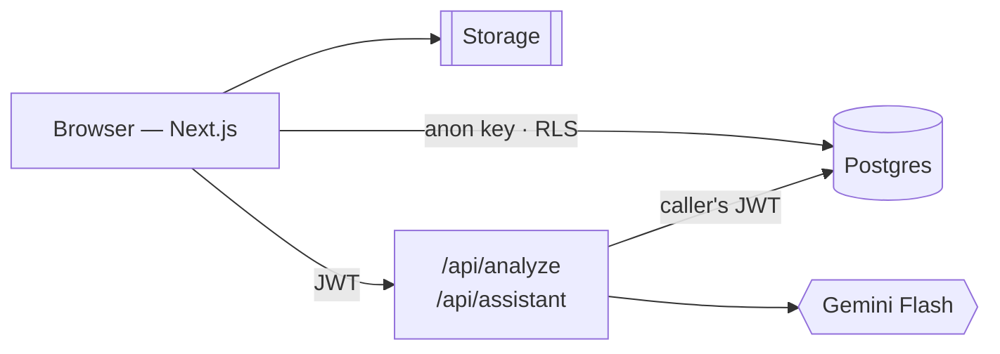

# What I Own

A personal inventory of the physical things you own — what you have, and where you put it.

The friction this removes is data entry. Typing 200 possessions into a spreadsheet is why nobody
has an inventory. So intake is the product: photograph an open drawer, and the app extracts every
item in it, files them all in that drawer, and stores **one** image rather than ten.

> **Status: early.** The repository is a Next.js scaffold — no Supabase, AI, or UI work has landed
> yet. Everything below the *Stack* section describes the design being built toward, not shipped
> behaviour. See [Roadmap](#roadmap).

---

## Two jobs, equally weighted

1. **Know what I own** — browse, total up, spot duplicates before buying the same cable again.
2. **Know where I put it** — find a specific thing months later without opening every drawer.

Success looks like: ten items added from one photo in under a minute including review, and
*"where is the spare HDMI cable"* answerable six months after entry.

## The intake loop

Four ways in, one pipeline. Photos are resized in the browser, uploaded straight to storage, and
analysed server-side; the model returns draft items with bounding boxes for review before anything
is saved.

| Mode | Input | Produces |
|---|---|---|
| `photo` | scene photos | items with bounding boxes |
| `receipt` | order screenshot | items with price, currency, purchase date |
| `voice` | short audio clip | items from speech |
| `manual` | typed | one item, no model call |

Capture is written to IndexedDB and drained by a retrying upload queue, so the core flow works in
a basement with no signal. Analysis needs connectivity; capture does not.

## Architecture at a glance

The browser talks to Supabase **directly** with the anon key and the user's session. Row-level
security is enforced by Postgres on every query, so the client never holds a credential that can
bypass it. Server code exists only where it must: two functions that hold the AI key, and a cron.



Consequences worth knowing:

- **Integrity rules live in the database.** The query layer is public, so CHECK constraints,
  foreign keys, and functions do the work — client-side validation counts for nothing.
- **Multi-row writes are Postgres functions.** `commit_intake` takes a whole batch as jsonb and
  succeeds or fails as one transaction, under the caller's RLS.
- **Bytes never transit a function body.** `/api/analyze` receives storage paths and fetches the
  image itself.

## Data model

Seven core tables: `items`, `images`, `item_images`, `locations`, `categories`, `tags`,
`currencies` — plus `messages` once the assistant lands.

- **One image, many items.** A drawer photo is uploaded once; `item_images` carries a normalized
  0–1 bounding box per item. No crop files are generated — a thumbnail is the full image with a
  CSS crop. This is the single biggest lever on storage, which is the constraint that binds first.
- **Money is ISO 4217 minor units** plus a currency reference carrying the exponent. `$1.05` is
  `105` with USD; `¥100` is `100` with JPY. Floating point is never used for money. Totals are
  per currency; there is no conversion.
- **Items have a lifecycle** — `wishlist → owned → disposed`. Because wishlist rows share the
  table, an `owned_items` view (`security_invoker`) is what every count, total, grid, and
  assistant tool reads, so no aggregate can quietly add money spent to money not yet spent.
- **Locations and categories are trees**, created inline during intake by typing
  `Bedroom / Wardrobe / Top drawer`. An item lives in exactly one location and may sit under many
  categories.
- **Derived, not stored:** idle state, days owned, cost per day. Only facts get columns.

## Stack

| Concern | Choice |
|---|---|
| Frontend | Next.js 16 (App Router), React 19, Tailwind v4 |
| Data | Supabase Postgres, queried from the browser under RLS |
| Migrations + types | Supabase CLI + `supabase gen types` — no ORM |
| Auth | Supabase Auth — email OTP + Google |
| Storage | Supabase Storage, private bucket, behind a thin adapter |
| AI | Gemini Flash via the Vercel AI SDK |
| i18n | `next-intl` — locale-prefixed routes, English and Chinese |
| Hosting | Netlify |

## Getting started

Requires Node 24+ and pnpm 11 (pinned in `devEngines`; corepack will fetch it).

```bash
pnpm install
pnpm dev
```

Then open [http://localhost:3000](http://localhost:3000).

| Script | Does |
|---|---|
| `pnpm dev` | development server (Turbopack) |
| `pnpm build` | production build |
| `pnpm start` | serve the production build |
| `pnpm lint` | ESLint |

No environment variables are needed yet — nothing external is wired up.

## Documentation

| Document | Covers |
|---|---|
| [docs/architecture.md](docs/architecture.md) | product scope, data model, RLS, the AI seam, intake and assistant flows, milestones |
| [docs/design.md](docs/design.md) | colour tokens, typography, components, motion, accessibility floor |

Both are placeholders today, filled in as the corresponding code lands. They are the record of
what was decided and why, so they are updated in the same commit as the code that changes them.

## Roadmap

| | Milestone | Contents |
|---|---|---|
| **M1** | Foundation | Supabase project, auth, seven tables, RLS policies and their test suite, `owned_items`, `commit_intake`, `location_subtree`, ISO 4217 seed, deploy, i18n scaffold |
| **M2** | Core inventory | CRUD, location and category trees, tags, money, browser image resize and upload queue, library grid, item detail. *Useful here with no AI at all.* |
| **M3** | Search and filters | full-text + trigram, filters by category, location subtree, tag, favourite, derived idle state, per-currency totals |
| **M4** | AI intake | the `lib/ai` seam, managed Gemini, four intake modes, box extraction, visual review screen, rate limiting |
| **M5** | Assistant | `messages` table, tool-calling chat over the query layer, friendly provider errors |

The assistant queries Postgres through tools rather than receiving the inventory as text — it
answers only from tool results, and says it cannot find something rather than guessing.

## Non-goals

Barcode/UPC lookup, price tracking, resale, shared or collaborative inventories, native apps,
full offline sync, and currency conversion. Deferred for now: bring-your-own-key and local models
(the provider seam exists, only managed Gemini ships), billing, additional languages, data export.
